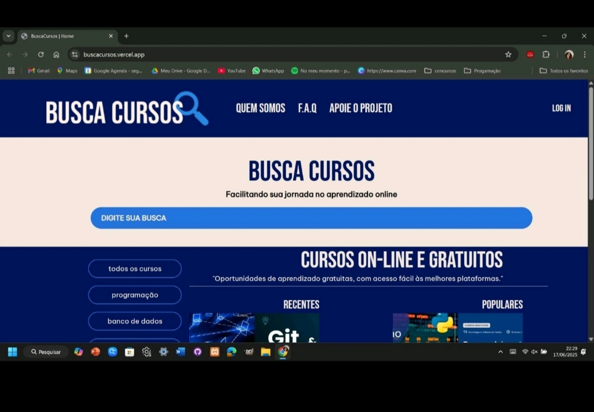

# Busca Cursos - Projeto Integrado DSM - FATEC/ZL

## Sobre o Projeto 🔍
  O Busca Cursos é um projeto que possui como objetivo democratizar e facilitar o acesso a cursos on-line gratuitos, criando um repositório correlacionando diversas plataformas educacionais gratuitas e seus respectivos cursos em um único lugar. Isso envolve arrecadar um volume significativo de links de cursos gratuitos de diferentes locais e organizá-los de forma correlacionada em um banco de dados. 
  A partir da interação do usuário com a plataforma Busca Cursos, será possível realizar buscas mais detalhadas utilizando filtros para refinar a procura, eliminando a necessidade de executar diversas buscas manuais diretamente em cada plataforma, assim evitando o uso de sites de busca que misturem conteúdos pagos entre os resultados da pesquisa, além de ajudar a promover canais de cursos grátis menos conhecidos e menos favorecidos pelos motores de busca convencionais.
  
## Funcionalidades
A plataforma Busca Cursos é capaz de: 
- Realizar Buscas em um repositório; 
- Filtrar e ordenar resultados de buscas; 
- Cadastrar os usuários;
- Gerenciar o cadastro dos usuários; 
- Recebe avaliações de usuários; 
- Disponibiliza avaliações dos usuários; 
- Receber sugestões dos usuários.
- Possibilita a realizção de Teste Vocacional
- Disponibiliza a função de favoritar cursos

## Instalação
  Não é necessário fazer a instalação da aplicação, sendo de acesso on-line.
  
## Pré-Requisitos
  Para obter acesso à plataforma e todos os seus recursos é necessário que o dispositivo utilizado tenha os seguintes requisitos mínimos: tela embutida ou periférica, acesso irrestrito à internet com uma conexão estável e instalação de navegador de internet em sua versão mais atualizada (Chrome, Opera, Mozilla e Edge). 
  
## Tecnologias Utilizadas
  
 

   
   
   
   
  
  
   

  

  
## Licença
Esse projeto está sob a licença MIT.

## Autoras
- Bianca Mendes [@Biancamsm](https://github.com/Biancamsm)
- Gabrielly de Souza [@Gabidanety](https://github.com/Gabidanety)
- Laura Valentim [@lauravalen](https://github.com/lauravalen)
- Natália Garces [@Natgalia98](https://github.com/Natgalia98)
- Natália Doreto [@Dorettto](https://github.com/Dorettto)

[Click aqui para assistir o vídeo demosntartivo]([https://youtu.be/4yA9iqzI0tM?feature=shared](https://www.dropbox.com/scl/fi/vwqhawgx3d9rolheu14q8/apresenta-o-final.mp4?rlkey=wlxk78zz7gbpyevh9zhs9uujb&st=epj8ccwf&dl=0)

